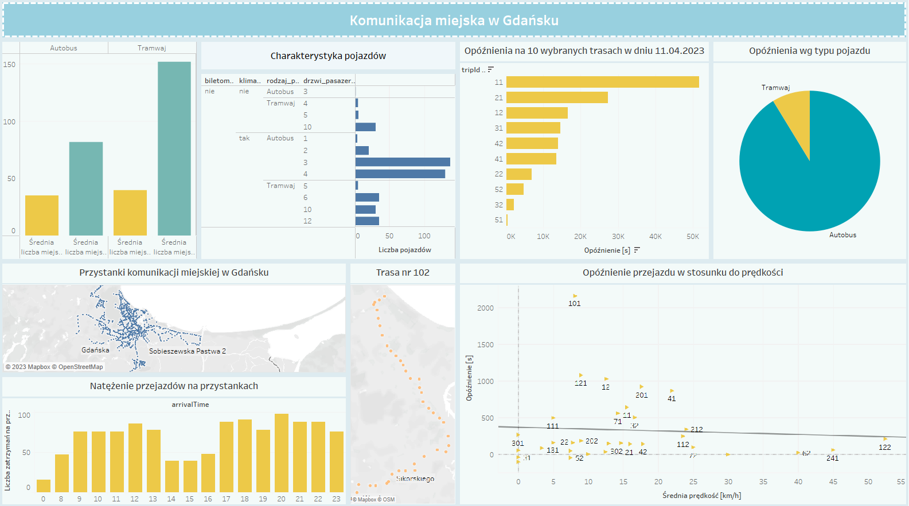

# Analysis of public transport in Gdansk

### Project Overview
---
This project provides insights into Gdansk ZTM data (public transport in Poland in the city of Gdansk).

The dashboard illustrates the following information:
* characteristics of vehicles available within ZTM;
* public transport stops in Gdansk on the map;
* selected bus route on the map;
* intensity of trips at public transport stations depending on the time of day;
* the relationship between the delay and the type of vehicle (tram/bus);
* the relationship between delay and the speed of a vehicle.

The dashboard was made using the Tableau tool.

A preview of the dashboard below:

### Data Sources

The primary dataset used for the analysis was downloaded from official [ZTM Gdansk](https://ckan.multimediagdansk.pl/dataset/tristar) site.
